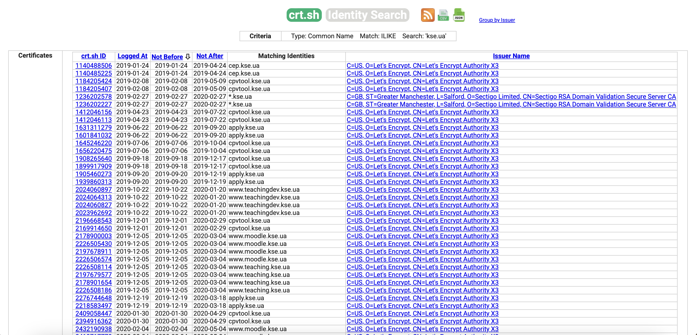
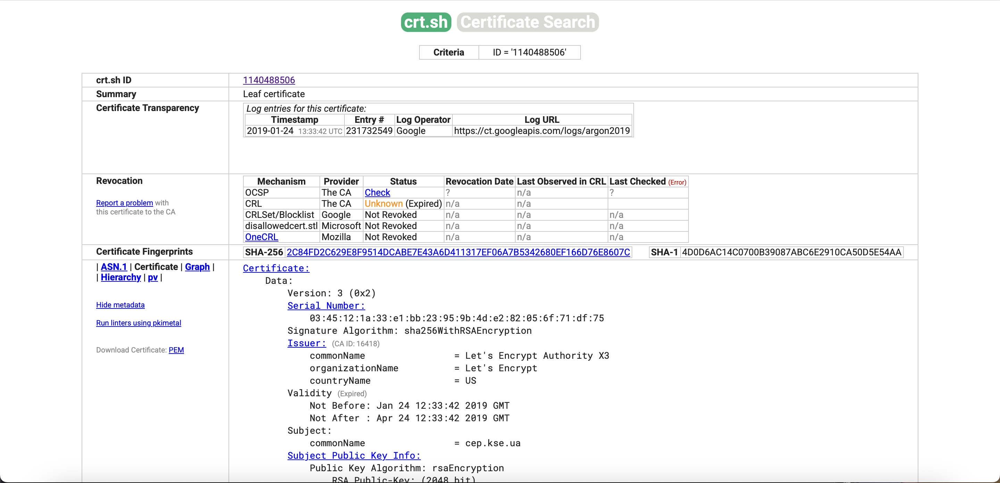
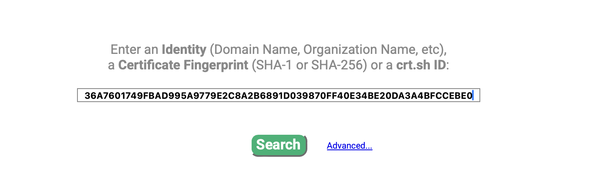
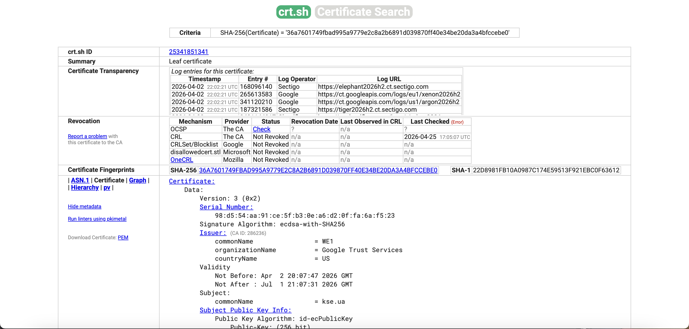

# ПРАКТИЧНЕ ЗАВДАННЯ #3-4

## Завдання 1
Алгоритм хешування
1. Доповнення повідомлення: написала функцію pad(), яка додає до вхідного масиву байтів одиничний біт (0x80), необхідну кількість нульових байтів та 64-бітне представлення оригінальної довжини повідомлення у Big-Endian. Це гарантує, що повідомлення оброблятиметься рівними блоками по 512 біт
2. У головному циклі кожен 512-бітний блок розбивається на шістнадцять 32-бітних слів, які потім розширюються до 64 слів за допомогою допоміжних функцій sigma0 і sigma1
3. Цикл стиснення. У кожній ітерації 64 раундів використовуються допоміжні функції Ch, Maj, Sigma0, Sigma1 та константи K для оновлення восьми 32-бітних змінних, які в кінці кожного блоку додаються до початкових значень H0-H7
4. Після завершення 64 раундів для поточного блоку результати додаються до проміжного хеш-значення по модулю 2^32

Тестування
- Я використала тестові вектори для перевірки правильності реалізації. **Всі тести пройшли успішно**
## Завдання 3

1. Генерація пари ключів RSA
    - Запускаю команду в терміналі:
    ```
    openssl genpkey -algorithm RSA -out server.key -pkeyopt rsa_keygen_bits:8192
   ```
    - Результатом є створення приватного ключа `server.key`
2. Створення запиту на сертифікат (CSR)
    - Використовую команду:
    ```
    openssl req -new -key server.key -out server.csr \
      -subj "/C=UA/L=Kyiv/O=KSE/CN=www.crypto.kse.ua/emailAddress=user@kse.org.ua" \
      -nodes
    ```
   - Це створює на основі приватного ключа файл `server.csr`, який містить запит до CA
3. Перевірка вмісту CSR
    - Використовую команду:
    ```
    openssl req -text -noout -verify -in server.csr
    ```
   - Результат:
   ```
   Certificate Request:
    Data:
        Version: 1 (0x0)
        Subject: C=UA, L=Kyiv, O=KSE, CN=www.crypto.kse.ua, emailAddress=user@kse.org.ua
        Subject Public Key Info:
            Public Key Algorithm: rsaEncryption
                Public-Key: (8192 bit)
                Modulus:
                    00:b7:c2:93:0f:d4:ee:74:b7:7e:e4:c7:ae:68:f6:
                    04:2d:06:5d:c3:2f:39:d8:1b:4d:75:4b:1b:b8:16:
                    ee:f6:3a:bd:4f:b9:5d:f4:d7:76:85:d3:58:64:06:
                    a0:a2:35:0e:e4:7a:ed:29:d1:d6:54:0c:f3:18:8e:
                    b1:91:ae:7c:62:aa:48:f0:20:c4:ca:0c:51:9f:52:
                    e9:da:bb:65:34:27:bf:d4:f8:87:54:1d:5c:ce:25:
                    c0:16:5d:8f:de:66:6f:2b:92:02:64:dd:67:e9:c5:
                    c1:21:62:21:b6:27:d5:d1:57:1c:aa:14:1c:b5:d4:
                    9b:c3:db:c8:9d:4e:23:c1:a5:55:b1:f0:51:f2:3d:
                    bc:fb:e8:78:ab:ec:a2:0d:17:3f:e0:e7:65:1b:8e:
                    e1:47:cd:d6:54:af:d1:52:4a:99:78:43:0b:72:da:
                    3b:40:c2:13:6b:c0:49:af:fc:5d:b8:e5:93:93:9a:
                    86:cc:f8:a6:09:25:ea:ac:09:aa:00:c4:42:2e:8f:
                    2c:7c:a6:6b:58:7f:2a:21:d6:2d:69:a5:1d:f0:ac:
                    0c:9f:7f:12:79:62:ce:1c:cc:f8:df:52:ee:29:d2:
                    4d:1f:7d:99:80:8a:bc:be:66:a8:bc:fd:29:7e:63:
                    81:e1:e1:5e:1d:f8:a2:a2:b7:7a:76:f5:48:61:8e:
                    d2:6a:72:78:94:ca:59:60:2d:5d:53:ad:aa:88:35:
                    cb:41:33:eb:34:fd:90:44:94:f0:e9:6f:12:85:f0:
                    5a:01:60:46:f0:24:9b:18:1c:86:84:05:ad:a6:7a:
                    35:e5:29:ae:e9:c2:80:04:bd:84:7b:e9:e4:fe:51:
                    7a:0a:53:53:66:59:e7:87:5b:a1:7e:34:e5:f4:df:
                    d8:7b:6e:6b:9a:97:22:39:cf:ec:a0:c4:6e:38:80:
                    a0:63:48:e3:30:ce:b8:7f:d8:2a:e6:ce:83:7f:4b:
                    ec:47:64:cf:67:63:bc:03:1e:3a:04:e7:69:56:35:
                    70:61:72:ce:0f:47:2e:33:a9:f4:3c:e7:f1:51:b3:
                    f3:0a:3d:85:37:5b:7f:bd:e1:39:e6:68:6a:86:aa:
                    ae:73:4b:db:a0:a4:c3:4b:67:9c:f5:72:f7:4a:ce:
                    11:78:8a:64:6f:d8:a1:b6:52:02:8d:69:55:d8:0b:
                    15:f6:c3:fa:16:3d:0e:17:1d:17:41:24:63:9b:1a:
                    fc:4b:d0:52:9a:23:ab:27:29:26:da:4e:e3:76:77:
                    45:27:1c:b2:9b:56:b9:4d:39:7f:61:9b:41:e9:a5:
                    a8:cf:e9:9e:64:cf:2b:e3:56:82:ad:6f:bd:3e:15:
                    08:c7:bb:61:9c:13:1d:6d:90:11:dd:27:d4:15:ec:
                    df:95:53:ae:30:ef:4f:13:be:1a:b9:e4:b3:fb:d4:
                    6e:60:26:cd:fb:c0:b2:28:93:51:d0:a6:10:5e:93:
                    e5:c8:4c:9c:bc:a7:32:47:73:02:df:6c:ab:30:29:
                    b6:51:38:32:fc:83:c3:23:2b:96:52:2b:ce:ed:7c:
                    06:cf:34:44:c2:41:bb:d0:31:f0:a2:34:31:c0:c9:
                    e1:80:f1:df:1f:9b:43:21:3b:d7:69:4e:00:77:1a:
                    cf:f4:c3:0f:0f:a7:77:e5:77:0d:b2:05:02:a6:15:
                    59:1a:35:4d:d6:c3:7c:e6:65:14:73:c1:1a:43:77:
                    77:f9:86:fb:f7:d5:24:8b:63:98:e8:e3:68:c7:b6:
                    64:c1:9b:be:e1:94:81:62:12:36:56:c7:5f:ae:90:
                    52:96:7c:76:bb:12:c2:1c:24:75:45:bb:6f:bb:26:
                    09:1e:86:f0:e5:70:ba:70:50:ab:63:30:c2:e0:96:
                    b2:39:1e:2a:de:83:a5:b4:27:8f:02:59:9e:5e:e8:
                    70:8b:f8:f8:ad:c6:da:f4:ca:ff:86:8d:dd:38:0b:
                    19:6e:e8:49:9d:b0:9a:ff:0a:68:bd:f5:ed:67:1e:
                    5f:dc:f1:74:4e:b4:ca:1a:6d:86:05:b7:4f:a4:bc:
                    8b:8c:85:21:01:c3:76:d3:9d:fd:25:51:df:5f:66:
                    16:2c:8b:09:d6:39:29:cf:10:28:5f:12:ab:4e:b8:
                    f6:6c:fc:0f:11:3f:7c:fe:42:88:f7:a0:38:02:f0:
                    cb:cc:92:41:88:36:50:29:9b:1a:f0:27:8d:e1:34:
                    3f:f3:c5:93:13:9a:8a:c0:f0:9d:ff:c4:b2:27:fe:
                    5b:ce:50:9b:4c:bb:5d:57:2a:23:e2:6f:9c:b0:e2:
                    19:4b:5a:a9:01:9a:b5:5e:b1:cd:db:e4:87:08:c4:
                    1b:89:03:26:13:61:b8:20:ba:6a:fc:0f:c2:69:68:
                    e2:78:79:e0:cc:54:62:a0:e8:fc:e2:4a:a9:87:72:
                    5e:b0:d2:8c:a9:35:89:00:7d:8a:9d:32:2d:87:de:
                    45:cb:b4:01:7d:86:b7:af:39:6a:eb:46:fd:33:3e:
                    d6:e3:d0:5b:c0:c3:d0:78:6f:64:43:9e:5f:5c:80:
                    fc:a0:94:30:1a:87:b6:4f:60:86:f8:56:e4:b9:bb:
                    73:b1:85:7a:83:6a:2a:fa:14:d8:48:93:2e:c0:83:
                    70:fa:2b:3f:cc:9b:e6:33:bd:ef:d8:16:c3:34:e1:
                    71:c3:ad:96:04:b2:5a:7b:d1:73:3f:af:73:06:81:
                    5c:7d:0e:d3:ff:19:d5:62:b8:30:fa:58:82:f6:2c:
                    6f:c5:6e:0a:7b:68:79:45:97:d4:cf:67:b1:0e:31:
                    50:80:ae:08:11
                Exponent: 65537 (0x10001)
        Attributes:
            (none)
            Requested Extensions:
    Signature Algorithm: sha256WithRSAEncryption
    Signature Value:
        5d:73:bc:e2:5c:09:7a:74:58:8b:30:4e:34:b6:6e:1a:af:c5:
        80:c1:4a:3d:1e:48:0d:d5:4f:55:cc:85:f8:00:3c:c8:a7:47:
        b8:ab:13:b5:94:5d:9b:09:89:40:63:39:05:2c:45:c8:0e:d5:
        bc:c4:4b:0f:d8:15:ce:ce:45:24:7d:a5:b4:35:d3:be:74:6a:
        ea:bb:c9:39:26:9e:6a:20:f7:4a:57:94:2e:59:c0:17:1b:13:
        30:32:31:ed:c3:01:8f:81:ca:5d:6b:bd:9f:ed:77:f8:c5:08:
        ae:8e:de:e2:0d:3c:ba:92:a5:ec:fe:1e:34:27:44:f9:02:34:
        12:a9:ec:b7:67:50:e6:b1:66:e4:d2:d9:92:ec:48:10:7a:2e:
        4e:3a:61:17:81:c5:43:15:1a:87:6d:6d:7f:dd:76:07:a7:35:
        56:ca:2f:e6:61:4b:89:e1:33:a0:f1:1e:53:db:df:77:23:fc:
        f5:0f:3e:e1:61:22:56:af:6f:c4:f4:93:61:07:5a:a9:1d:e2:
        81:0f:0f:d1:22:a5:a2:4d:d0:97:37:be:dd:c7:15:ee:c4:75:
        fa:0f:d6:3f:e8:f3:84:ff:05:ea:68:5d:6e:f2:c6:07:4d:f2:
        b8:07:44:fc:ca:44:a6:76:8d:f9:73:0f:05:65:42:8c:cf:17:
        6d:80:6a:1e:8b:07:8f:d3:bc:d7:6b:f9:b7:2a:4c:c5:f3:41:
        85:cb:22:55:1e:43:dc:0b:0a:60:fd:79:89:45:6b:18:d3:c9:
        3c:8e:16:89:d1:5c:f9:1f:27:da:ea:f3:2a:53:cd:5a:0b:0a:
        cf:b6:b9:3d:a7:e8:00:ec:61:40:b1:7a:d4:f5:f5:2e:5f:ea:
        0a:f7:63:61:b1:d6:c3:5d:22:9f:a9:7b:09:79:8f:14:1a:2e:
        3c:f3:47:01:2f:56:ff:3a:5f:c2:08:35:d1:65:a2:ed:33:a3:
        fd:9f:db:54:22:83:0e:8c:63:d4:af:30:f0:01:6f:38:70:56:
        b5:15:12:13:0f:4f:9c:db:50:aa:9e:01:db:2f:15:51:c2:d4:
        b1:a4:71:1c:a9:13:01:fb:8f:73:6b:16:17:b5:e8:8d:e1:18:
        3d:49:11:4f:02:6a:da:35:a8:17:0b:13:fa:88:7c:3e:35:d7:
        3c:56:a6:d2:ac:02:48:07:a8:27:dd:98:bf:fd:02:9a:9b:b0:
        ce:f9:e6:17:16:16:5b:3c:a9:86:d3:39:72:1a:2e:15:d0:53:
        c4:87:31:b1:6a:e3:7e:d6:45:38:ab:5d:e4:65:16:ec:87:9f:
        7b:92:0e:18:20:a3:d1:19:22:08:ad:68:2e:ab:42:01:1a:1d:
        63:21:65:35:78:1a:a3:fb:9a:db:b9:d2:61:48:75:38:9b:43:
        28:4f:43:26:b8:6a:16:f3:37:2e:a7:d3:f4:35:f1:32:e1:e4:
        c3:69:b4:5d:a2:78:9d:1f:eb:e6:87:42:0e:7c:d0:ca:5b:49:
        7f:a7:40:f6:46:20:47:6f:34:f9:d9:c9:d0:1b:a2:a0:51:5f:
        f3:42:ca:f8:0a:ba:d0:89:d7:83:41:82:14:5a:15:7c:96:b3:
        ae:61:30:10:88:62:61:92:ee:97:7e:5a:84:3e:7a:da:c4:11:
        83:a9:4b:1f:2b:bd:c5:da:a1:ae:00:b7:8b:1e:1e:d7:91:8a:
        99:83:57:93:32:af:57:7b:25:8a:34:67:df:23:2c:30:80:56:
        ac:e2:fe:bc:ca:60:04:44:e8:46:5c:84:05:ac:29:c0:46:09:
        18:e1:3b:e5:70:92:dd:11:98:e7:ef:8d:d4:b7:2c:4d:49:6b:
        cb:a0:8d:17:2b:71:41:03:a8:f6:5b:41:ea:8d:a4:61:6b:a4:
        8f:39:44:0e:06:94:79:2f:7e:a2:e7:22:06:4c:de:70:ef:b9:
        6a:78:1f:03:28:bf:8e:f7:58:75:29:48:31:73:a9:26:cc:e3:
        36:97:99:24:b9:c6:04:ee:3b:c9:43:53:d7:2d:89:bb:94:b4:
        dd:97:fb:72:ba:03:2c:0c:73:4e:1d:40:c4:1c:b4:c0:7c:81:
        d6:a2:e6:06:cd:27:d2:cd:f8:f2:31:4d:37:7f:97:99:23:0e:
        08:4c:5d:12:26:28:0a:6d:31:de:b0:40:18:6f:24:f6:e7:4b:
        6b:a7:1b:40:0b:27:e5:a2:d2:b1:ef:7e:69:a8:5f:06:a3:92:
        73:96:c4:89:3a:18:a0:c6:c3:2e:2f:d5:74:08:10:83:e0:80:
        d1:8d:3f:4b:a2:72:f1:49:f2:fe:ae:33:21:ea:ba:a7:c6:5c:
        bf:b6:9d:71:e5:0c:7d:d1:69:e5:bc:8f:5f:3b:0d:5e:c2:15:
        60:55:82:e2:5a:97:31:9e:cf:13:9d:4a:4b:ac:b3:53:5a:36:
        16:00:c6:02:2e:68:fc:f6:a9:99:b8:8c:a4:16:19:57:e3:14:
        80:31:db:7b:98:b4:ac:85:8b:27:a0:27:57:f0:40:0a:c9:30:
        92:ef:6e:f4:c8:f5:f6:d8:a7:eb:cc:02:53:b4:05:52:ca:e3:
        0f:11:6c:98:3b:a1:e6:91:45:ac:aa:2c:da:28:32:77:14:fc:
        0d:f6:22:31:b0:0a:bb:b5:55:83:70:51:79:bb:d9:5d:8c:b1:
        51:cc:a7:30:ef:9b:db:5f:e0:33:dc:e8:ac:4d:5c:f5:84:1b:
        09:9a:1d:20:42:5f:9d:f0:5e:e3:02:0d:6d:09:5e:26
    ```
   - З важливого: Subject містить інфо про організацію, країну, місто та інше, які будуть включені в сертифікат. Public Key Info показує алгоритм та розмір ключа. Signature Algorithm показує алгоритм підпису, який використовується для підпису CSR.
4. Створення самопідписного сертифіката
    - Використовую команду:
    ```
    openssl x509 -req -sha256 -in server.csr -signkey server.key -out server.crt
    ```
   - Резульат:
    ```
    Certificate request self-signature ok
    subject=C=UA, L=Kyiv, O=KSE, CN=www.crypto.kse.ua, emailAddress=user@kse.org.ua
    ```
   - замість того щоб відправляти CSR до зовнішнього CA, я підписую його тим самим приватним ключем. Результат файл server.crt
5. Дослідження вмісту сертифікату Використовую команду:
  ```
  openssl x509 -text -noout -in server.crt
  ```
   - Результат:

    Certificate:
     Data:
        Version: 3 (0x2)
        Serial Number:
            3a:98:51:9f:42:d2:8e:23:eb:64:4d:5d:e5:59:3d:89:0a:9d:12:10
        Signature Algorithm: sha256WithRSAEncryption
        Issuer: C=UA, L=Kyiv, O=KSE, CN=www.crypto.kse.ua, emailAddress=user@kse.org.ua
        Validity
            Not Before: May  1 17:19:39 2026 GMT
            Not After : May 31 17:19:39 2026 GMT
        Subject: C=UA, L=Kyiv, O=KSE, CN=www.crypto.kse.ua, emailAddress=user@kse.org.ua
        Subject Public Key Info:
            Public Key Algorithm: rsaEncryption
                Public-Key: (8192 bit)
                Modulus:
                    00:b7:c2:93:0f:d4:ee:74:b7:7e:e4:c7:ae:68:f6:
                    04:2d:06:5d:c3:2f:39:d8:1b:4d:75:4b:1b:b8:16:
                    ee:f6:3a:bd:4f:b9:5d:f4:d7:76:85:d3:58:64:06:
                    a0:a2:35:0e:e4:7a:ed:29:d1:d6:54:0c:f3:18:8e:
                    b1:91:ae:7c:62:aa:48:f0:20:c4:ca:0c:51:9f:52:
                    e9:da:bb:65:34:27:bf:d4:f8:87:54:1d:5c:ce:25:
                    c0:16:5d:8f:de:66:6f:2b:92:02:64:dd:67:e9:c5:
                    c1:21:62:21:b6:27:d5:d1:57:1c:aa:14:1c:b5:d4:
                    9b:c3:db:c8:9d:4e:23:c1:a5:55:b1:f0:51:f2:3d:
                    bc:fb:e8:78:ab:ec:a2:0d:17:3f:e0:e7:65:1b:8e:
                    e1:47:cd:d6:54:af:d1:52:4a:99:78:43:0b:72:da:
                    3b:40:c2:13:6b:c0:49:af:fc:5d:b8:e5:93:93:9a:
                    86:cc:f8:a6:09:25:ea:ac:09:aa:00:c4:42:2e:8f:
                    2c:7c:a6:6b:58:7f:2a:21:d6:2d:69:a5:1d:f0:ac:
                    0c:9f:7f:12:79:62:ce:1c:cc:f8:df:52:ee:29:d2:
                    4d:1f:7d:99:80:8a:bc:be:66:a8:bc:fd:29:7e:63:
                    81:e1:e1:5e:1d:f8:a2:a2:b7:7a:76:f5:48:61:8e:
                    d2:6a:72:78:94:ca:59:60:2d:5d:53:ad:aa:88:35:
                    cb:41:33:eb:34:fd:90:44:94:f0:e9:6f:12:85:f0:
                    5a:01:60:46:f0:24:9b:18:1c:86:84:05:ad:a6:7a:
                    35:e5:29:ae:e9:c2:80:04:bd:84:7b:e9:e4:fe:51:
                    7a:0a:53:53:66:59:e7:87:5b:a1:7e:34:e5:f4:df:
                    d8:7b:6e:6b:9a:97:22:39:cf:ec:a0:c4:6e:38:80:
                    a0:63:48:e3:30:ce:b8:7f:d8:2a:e6:ce:83:7f:4b:
                    ec:47:64:cf:67:63:bc:03:1e:3a:04:e7:69:56:35:
                    70:61:72:ce:0f:47:2e:33:a9:f4:3c:e7:f1:51:b3:
                    f3:0a:3d:85:37:5b:7f:bd:e1:39:e6:68:6a:86:aa:
                    ae:73:4b:db:a0:a4:c3:4b:67:9c:f5:72:f7:4a:ce:
                    11:78:8a:64:6f:d8:a1:b6:52:02:8d:69:55:d8:0b:
                    15:f6:c3:fa:16:3d:0e:17:1d:17:41:24:63:9b:1a:
                    fc:4b:d0:52:9a:23:ab:27:29:26:da:4e:e3:76:77:
                    45:27:1c:b2:9b:56:b9:4d:39:7f:61:9b:41:e9:a5:
                    a8:cf:e9:9e:64:cf:2b:e3:56:82:ad:6f:bd:3e:15:
                    08:c7:bb:61:9c:13:1d:6d:90:11:dd:27:d4:15:ec:
                    df:95:53:ae:30:ef:4f:13:be:1a:b9:e4:b3:fb:d4:
                    6e:60:26:cd:fb:c0:b2:28:93:51:d0:a6:10:5e:93:
                    e5:c8:4c:9c:bc:a7:32:47:73:02:df:6c:ab:30:29:
                    b6:51:38:32:fc:83:c3:23:2b:96:52:2b:ce:ed:7c:
                    06:cf:34:44:c2:41:bb:d0:31:f0:a2:34:31:c0:c9:
                    e1:80:f1:df:1f:9b:43:21:3b:d7:69:4e:00:77:1a:
                    cf:f4:c3:0f:0f:a7:77:e5:77:0d:b2:05:02:a6:15:
                    59:1a:35:4d:d6:c3:7c:e6:65:14:73:c1:1a:43:77:
                    77:f9:86:fb:f7:d5:24:8b:63:98:e8:e3:68:c7:b6:
                    64:c1:9b:be:e1:94:81:62:12:36:56:c7:5f:ae:90:
                    52:96:7c:76:bb:12:c2:1c:24:75:45:bb:6f:bb:26:
                    09:1e:86:f0:e5:70:ba:70:50:ab:63:30:c2:e0:96:
                    b2:39:1e:2a:de:83:a5:b4:27:8f:02:59:9e:5e:e8:
                    70:8b:f8:f8:ad:c6:da:f4:ca:ff:86:8d:dd:38:0b:
                    19:6e:e8:49:9d:b0:9a:ff:0a:68:bd:f5:ed:67:1e:
                    5f:dc:f1:74:4e:b4:ca:1a:6d:86:05:b7:4f:a4:bc:
                    8b:8c:85:21:01:c3:76:d3:9d:fd:25:51:df:5f:66:
                    16:2c:8b:09:d6:39:29:cf:10:28:5f:12:ab:4e:b8:
                    f6:6c:fc:0f:11:3f:7c:fe:42:88:f7:a0:38:02:f0:
                    cb:cc:92:41:88:36:50:29:9b:1a:f0:27:8d:e1:34:
                    3f:f3:c5:93:13:9a:8a:c0:f0:9d:ff:c4:b2:27:fe:
                    5b:ce:50:9b:4c:bb:5d:57:2a:23:e2:6f:9c:b0:e2:
                    19:4b:5a:a9:01:9a:b5:5e:b1:cd:db:e4:87:08:c4:
                    1b:89:03:26:13:61:b8:20:ba:6a:fc:0f:c2:69:68:
                    e2:78:79:e0:cc:54:62:a0:e8:fc:e2:4a:a9:87:72:
                    5e:b0:d2:8c:a9:35:89:00:7d:8a:9d:32:2d:87:de:
                    45:cb:b4:01:7d:86:b7:af:39:6a:eb:46:fd:33:3e:
                    d6:e3:d0:5b:c0:c3:d0:78:6f:64:43:9e:5f:5c:80:
                    fc:a0:94:30:1a:87:b6:4f:60:86:f8:56:e4:b9:bb:
                    73:b1:85:7a:83:6a:2a:fa:14:d8:48:93:2e:c0:83:
                    70:fa:2b:3f:cc:9b:e6:33:bd:ef:d8:16:c3:34:e1:
                    71:c3:ad:96:04:b2:5a:7b:d1:73:3f:af:73:06:81:
                    5c:7d:0e:d3:ff:19:d5:62:b8:30:fa:58:82:f6:2c:
                    6f:c5:6e:0a:7b:68:79:45:97:d4:cf:67:b1:0e:31:
                    50:80:ae:08:11
                Exponent: 65537 (0x10001)
        X509v3 extensions:
            X509v3 Subject Key Identifier: 
                2C:D9:CD:EE:B3:D6:6B:26:F5:6E:F0:FD:1D:7F:44:DA:B7:EF:15:C5
    Signature Algorithm: sha256WithRSAEncryption
    Signature Value:
        61:08:d6:3d:30:6f:7a:4e:6c:f6:78:a3:32:e7:f8:49:0f:cc:
        5c:60:df:bf:92:43:dd:51:d9:0d:dc:84:12:af:35:29:08:b5:
        53:e1:b7:c4:12:c5:eb:8e:87:f1:58:4b:b7:3b:32:91:f1:c1:
        9f:5f:0e:6e:73:25:b1:40:8d:65:13:88:44:ae:74:b7:c3:24:
        97:34:20:99:80:cb:6a:92:79:b0:98:98:12:1d:d9:f7:fd:84:
        a5:e5:59:8e:01:0a:9c:bd:ec:da:22:46:50:25:9e:17:33:a5:
        b8:ff:52:3a:69:0e:27:42:37:40:6d:97:ef:e0:ea:46:78:d1:
        6e:84:6b:6a:1b:22:be:60:ab:18:fa:7b:ad:22:35:65:11:8d:
        49:d5:77:76:6d:62:40:3f:d6:0c:75:1f:e1:9d:e1:2a:64:3b:
        11:74:9e:75:b3:72:a3:47:23:f4:12:7d:35:77:7c:69:1e:34:
        02:04:42:90:b6:6a:8b:1f:af:fb:da:ec:47:0b:c3:d8:bf:44:
        7a:b5:9a:8b:dc:fc:85:16:33:7c:bb:a3:df:16:9c:b4:de:31:
        e2:4b:15:c9:cc:60:88:ce:62:d0:04:a5:43:51:f8:7e:44:a8:
        c2:04:5d:8e:13:2b:a4:de:82:99:ab:f2:e7:84:ce:18:94:71:
        70:00:3e:d5:71:a7:a6:1e:bf:21:26:c2:ce:8e:64:e1:47:9e:
        ea:48:58:a8:9b:54:a0:cd:c4:d5:6e:fa:3e:3c:fb:8d:fe:c7:
        2a:8a:4a:2d:5e:ea:59:54:27:f7:83:41:00:e1:e6:a8:70:35:
        68:b1:15:67:b7:4b:82:f4:0a:2f:76:b6:60:49:4d:ee:66:e4:
        af:6d:97:c9:bb:55:02:90:28:bc:97:4b:4a:00:13:10:64:05:
        a9:62:07:f3:71:15:b3:2a:16:33:6c:28:50:38:fc:97:a2:69:
        bf:23:5c:e1:16:a7:f3:05:19:18:43:72:c7:68:5f:46:d9:bd:
        ca:71:d1:73:cb:10:af:d2:a4:03:36:92:78:a3:6d:0d:6b:ec:
        e5:14:79:76:99:b5:d3:57:27:38:9b:73:d1:56:6c:c9:12:5a:
        65:87:65:ba:a9:e5:3f:12:c9:6b:49:20:d2:1a:52:6a:88:87:
        c9:b5:35:37:48:d0:52:18:de:9d:aa:00:1c:de:2e:bc:1b:d6:
        c3:d4:cd:f5:9c:3c:c7:b8:ca:e7:fd:e1:d8:5a:94:21:9e:77:
        49:6d:cf:c8:b0:df:ab:24:48:90:8a:b4:54:0a:98:fd:2d:62:
        b3:82:74:35:7d:21:d8:dc:d8:31:bf:f5:65:b4:73:54:6f:aa:
        b3:de:20:b1:38:c4:37:b3:87:2f:09:90:e5:67:78:2a:7a:56:
        fe:a6:a1:ba:61:c5:45:fe:5a:4f:5f:51:ff:e1:80:a5:09:0d:
        de:3d:09:26:fd:a7:2c:51:78:55:d4:e6:1c:6f:06:f4:5a:bc:
        19:36:96:bf:db:fe:c2:90:e9:fe:26:16:e6:37:7a:da:93:e7:
        b3:6a:78:e6:13:e1:b9:a0:b2:10:0a:2d:64:e8:1c:78:30:ba:
        91:aa:85:e3:70:69:bd:be:24:b6:d4:33:68:c8:1e:d1:41:df:
        ab:9d:39:89:0d:9e:3a:89:0b:da:2b:5e:53:46:18:10:53:46:
        7c:77:48:63:ed:eb:43:3a:05:e8:8c:02:18:ae:33:4f:21:b1:
        1b:40:cb:68:95:6c:a7:76:62:ea:80:24:e7:aa:80:14:b7:ea:
        10:e1:a1:ac:35:fa:fd:96:94:9c:71:de:31:67:d2:40:5b:a6:
        b5:af:68:e9:ce:bd:06:31:e6:c3:7c:b9:06:51:b6:59:a6:41:
        59:59:4f:74:46:60:4b:24:7c:be:43:ec:8b:5f:47:7f:02:cd:
        2f:d8:4b:63:62:02:24:20:e9:3f:0c:2d:ef:18:64:20:37:e7:
        1b:b5:f1:01:22:20:09:21:66:73:07:aa:a2:47:9a:17:02:fd:
        1d:ba:cb:2e:38:c3:9c:e1:8a:19:15:1b:c4:b2:5e:9b:a1:e4:
        7b:af:86:02:fd:b7:0a:50:b0:31:85:2c:2a:3e:5f:aa:79:dc:
        33:ac:09:6f:72:d7:28:96:b9:64:43:fc:cc:d2:0c:9c:79:ae:
        a0:81:25:93:db:0a:dd:18:9c:25:aa:87:ab:2d:24:21:b1:16:
        c2:5c:e5:dd:52:e7:6e:cd:2b:25:60:bd:73:f0:f9:b5:f9:0b:
        63:7a:b5:d5:25:b5:c7:18:e0:29:f3:15:5b:0c:75:50:ea:40:
        75:d6:99:76:bf:40:5a:4f:ff:03:b0:b6:65:5e:1b:d8:8f:4e:
        2d:24:e1:b2:c6:79:8d:1d:69:30:af:f3:35:17:d3:0c:02:28:
        2e:ce:42:9e:c2:b6:93:84:cf:aa:c2:53:e5:38:1f:be:a8:5a:
        dc:5f:d7:73:34:c8:0f:52:67:c2:95:bf:f4:88:eb:01:f8:65:
        a9:25:b4:af:5e:cc:fa:28:25:aa:42:9c:f5:f2:37:7e:e0:eb:
        04:b7:e5:20:11:2a:68:aa:41:2d:72:1b:ca:5e:83:31:ca:4a:
        f3:54:b6:20:8f:56:a2:aa:60:c7:8f:8b:ae:70:b0:2e:f3:e5:
        6d:4c:0b:2e:c4:24:18:14:01:1a:8b:7c:fe:1a:fb:7e:3b:0b:
        bf:7d:ab:2f:12:99:22:8c:9e:67:e5:a7:c5:e5:db:e8

   - тут можна виділити наступну інформацію
     - serial number - унікальний ідентифікатор сертифіката
     - issue і subject одинакові, оскільки це самопідписний сертифікат
     - Not before і Not after - термін дії
     - Public Key: (8192 bit) - публічний ключ із мого server.key
     - І також алгоритм підпису


## Завдання 7
1. Виконла пошук домену на сайті 
2. Відсортувала за колонкою "Not before", перший рядок і є найстрашим сертифікатом

3. Про сертифікат
    - Id: 1140488506
    - Serial number: 03:45:12:1a:33:e1:bb:23:95:9b:4d:e2:82:05:6f:71:df:75
    - Дата видачі: Jan 24 12:33:42 2019 GMT
    - Дата закінчення: Apr 24 12:33:42 2019 GMT
    - Сommon name: cep.kse.ua
    - Issuer: commonName = Let's Encrypt Authority X3, organizationName = Let's Encrypt, countryName = US


## Завдання 8
1. на сайті crt.sh здйснила пошук сертифікуту "36:A7:60:17:49:FB:AD:99:5A:97:79:E2:C8:A2:B6:89:1D:03:98:70:FF:40:E3:4B:E2:
0D:A3:A4:BF:CC:EB:E0"

2. Завантажила PEM файл сертифіката (він перейменований на kse_cert.crt)

3. Пояснення по скрипту:
    - Відбиток сертифікату це хеш від його бінарного формату (DER)
    - Я відкинула begin, end і всі пусті рядки
    - Склуяли рядки в один в змінну base64_data
    - Потім декодувала base64_data в сирий бінарний формат і отримала DER
    - Передала в мою sha256 (тут додала bytearray щоб pad працював нормально)
    - і потім все це гарно форматнула
    - вуаля - отримали розразований відбиток сертифікату
4. Отриманий хеш збігається із тим який заданий в завданні. Тобто fingerprint=sha256(бінарний файл сертифіката в DER)
      
